# Helix Demo — Component Diagram

```mermaid
graph TD
    %% ── Styling ────────────────────────────────────────────────
    classDef ui fill:#4f8ef7,stroke:#2563eb,color:#fff
    classDef agent fill:#a78bfa,stroke:#7c3aed,color:#fff
    classDef mcp fill:#38bdf8,stroke:#0284c7,color:#fff
    classDef rag fill:#f97316,stroke:#c2410c,color:#fff
    classDef infra fill:#64748b,stroke:#475569,color:#fff
    classDef obs fill:#34d399,stroke:#059669,color:#fff

    %% ── User Interfaces ────────────────────────────────────────
    UI["Helix UI :5000"]:::ui
    RAGUI["RAG KB UI :3200"]:::rag

    %% ── A2A Agent Layer ────────────────────────────────────────
    subgraph Agents["A2A Agents"]
        direction TB
        A2AReg["Agent Registry :8100"]:::agent
        HelixA["Helix-A :8000\nSupervisor Agent"]:::agent
        HelixB["Helix-B :8001\nDelegation Agent"]:::agent
        Weather["Weather Agent :10010"]:::agent
        Currency["Currency Agent :10000"]:::agent
    end

    %% ── MCP Tool Layer ─────────────────────────────────────────
    subgraph MCPTools["MCP Tools"]
        direction TB
        MCPReg["MCP Registry :9000"]:::mcp
        Charts["Chart Server :3131"]:::mcp
        Map["Map Server :3132"]:::mcp
        DemoMCP["Demo MCP Apps\n:3100-3130"]:::mcp
        HostMCP["Host MCP Servers\n(self-registering)"]:::mcp
    end

    %% ── RAG Knowledge Base ─────────────────────────────────────
    subgraph RAG["RAG Knowledge Base"]
        direction TB
        RAGAPI["RAG API :8200"]:::rag
        RAGMCP["RAG MCP :8201"]:::rag
        Qdrant["Qdrant :6333"]:::rag
        Ingest["Ingest Worker"]:::rag
    end

    %% ── Infrastructure ─────────────────────────────────────────
    subgraph Infra["Infrastructure"]
        direction LR
        PG["PostgreSQL :5432"]:::infra
        Redis["Redis :6379"]:::infra
        RAGPG["RAG Postgres :5433"]:::infra
        RAGRedis["RAG Redis :6380"]:::infra
        Embeddings["Docker Model Runner\nai/embeddinggemma"]:::infra
    end

    %% ── Observability ──────────────────────────────────────────
    Langfuse["Langfuse :3000"]:::obs

    %% ── User → App connections ─────────────────────────────────
    UI -- "chat" --> HelixA
    RAGUI -- "documents" --> RAGAPI

    %% ── A2A connections ────────────────────────────────────────
    HelixA -- "registers & discovers" --> A2AReg
    HelixB -- "registers" --> A2AReg
    HelixA -- "A2A delegate" --> HelixB
    HelixB -- "A2A" --> Weather
    HelixB -- "A2A" --> Currency

    %% ── MCP connections ────────────────────────────────────────
    HelixA -- "tool discovery" --> MCPReg
    MCPReg -. "registered" .-> Charts
    MCPReg -. "registered" .-> Map
    MCPReg -. "registered" .-> DemoMCP
    MCPReg -. "registered" .-> HostMCP
    MCPReg -. "registered" .-> RAGMCP

    %% ── RAG internal connections ───────────────────────────────
    RAGAPI --> Qdrant
    RAGAPI --> RAGPG
    RAGAPI --> RAGRedis
    RAGMCP --> Qdrant
    Ingest --> Qdrant
    Ingest --> RAGRedis
    Ingest --> RAGPG
    RAGMCP -- "embeddings" --> Embeddings
    Ingest -- "embeddings" --> Embeddings

    %% ── Observability connections ──────────────────────────────
    HelixA -. "traces" .-> Langfuse
    HelixB -. "traces" .-> Langfuse
```

---

## Component Summary

| Component | Port | Description |
|---|---|---|
| **Helix UI** | 5000 | Chat interface for interacting with Helix agents |
| **Helix-A** | 8000 | Supervisor agent (`deep_wired` workflow), A2A server |
| **Helix-B** | 8001 | Delegation agent, routes to leaf agents |
| **Agent Registry** | 8100 | A2A agent discovery (tag-filtered) |
| **Weather Agent** | 10010 | Leaf A2A agent (statically wired to Helix-B) |
| **Currency Agent** | 10000 | Leaf A2A agent (statically wired to Helix-B) |
| **MCP Registry** | 9000 | MCP tool discovery (pre-seeded + dynamic registration) |
| **Chart Server** | 3131 | MCP chart tools (bar, line, pie) |
| **Map Server** | 3132 | MCP geospatial/mapping tools |
| **Demo MCP Apps** | 3100-3130 | Additional MCP tool servers |
| **RAG KB UI** | 3200 | Document management interface |
| **RAG KB API** | 8200 | FastAPI backend for document CRUD and search |
| **RAG KB MCP** | 8201 | MCP server exposing RAG search to Helix agents |
| **Qdrant** | 6333 | Vector database for semantic search |
| **Langfuse** | 3000 | Observability and trace viewer |
| **PostgreSQL** | 5432 | Helix metadata (Langfuse, agent registry) |
| **Redis** | 6379 | Helix job queue and caching |
| **RAG Postgres** | 5433 | RAG document metadata |
| **RAG Redis** | 6380 | RAG ingestion job queue |
| **Docker Model Runner** | — | Local embedding model (`ai/embeddinggemma`, 768-dim) |

## How It Connects

- **Users** interact via **Helix UI** (chat) or **RAG KB UI** (document management)
- **Helix-A** orchestrates work: discovers agents via the **Agent Registry**, delegates tasks to **Helix-B**, and calls MCP tools via the **MCP Registry**
- **Helix-B** handles sub-tasks by routing to **Weather** and **Currency** leaf agents
- **RAG KB MCP** is registered in the **MCP Registry**, making knowledge base search available as a tool to Helix agents
- **Docker Model Runner** provides local embeddings for RAG document ingestion and search
- **Langfuse** collects traces from all Helix agent interactions
